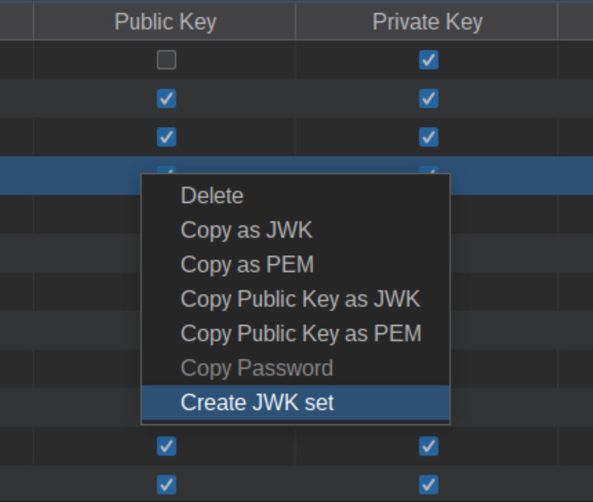

# JWT Editor

*JWT Editor* is a Burp Suite extension which aims to be a Swiss Army Knife for manipulating JSON Web Tokens (JWTs) within Burp Suite.
It provides detection of JWTs within both HTTP and WebSocket messages and allows for their editing,
signing, verifying, encryption and decryption. 
Additionally it facilitates several well-known attacks against JWT implementations.

## Overview
*JWT Editor* adds the follow functionality:

* A top level tab titled `JWT Editor`
* A custom tab `JSON Web Token` tab within HTTP messages containing JWTs
* JWT highlighting within proxied HTTP and WebSocket messages
* JWS Intruder payload provider
* JWS Scanner insertion point provider

## Changelog

**Unreleased**
- Add ability to test for HMAC signatures using [weak secrets](https://github.com/wallarm/jwt-secrets).
- Add import capability for JWK data.
- Remember last used key within Signing dialog.

**2.4 2024-12-24**
- Add support for non-JSON claims within JWS (Thanks to [@Hannah-PortSwigger](https://github.com/Hannah-PortSwigger) for suggesting this).

**2.3 2024-08-05**
- Add Information panel to JWS view showing decoded *iat*, *nbf* and *exp* values (Thanks to [@exploide](https://github.com/exploide) for collaborating on this).
- Add support for WebSocket messages containing JWT's.
- Preserve JWT order when message has multiple JWT's.
- Remove use of commons-lang3.

**2.2.2 2024-07-12**
- Fix issue where JWT's highlighted in Proxy regardless of config setting (Thanks to [@serate-actual](https://github.com/serate-actual) for reporting this).

**2.2.1 2024-05-06**
- Fix issue where an invalid Intruder signing key could prevent the extension from loading (Thanks to [@sebastianosrt](https://github.com/sebastianosrt) for reporting this).

**2.2 2024-02-29**
- Allow resigning of JWS tokens during fuzzing (Thanks to [@BafDyce](https://github.com/BafDyce)).

**2.1.1 2024-01-22**
- Use split panes to improve JWT editor with small screens or large font sizes (Thanks to [@eldstal](https://github.com/eldstal)).

**2.1 2024-01-01**
- Allow key IDs to be set before keys generated.
- Make symmetric and asymmetric key dialogs consistent.
- Fix bug allowing keys with duplicate IDs.

**2.0.2 2023-12-13**
- Fix memory leaks when deleting tabs containing JWTs.

**2.0.1  2023-10-30**
- Generate valid URL's when embedding Collaborator payloads within *x5u* and *jku* headers.

**2.0  2023-07-08**

Forked from [Fraser Winterborn](https://uk.linkedin.com/in/fraser-winterborn-198b8a129)'s version (original [repository](https://github.com/blackberry/jwt-editor)).
* Payload processing rule to support fuzzing within JWS.
* Insertion point provider for JWS header parameters.
* JWT highlighting within WebSocket messages.
* Update to Java 17 and PortSwigger's new Montoya API.
* Add ability to enable/disable JWT highlighting within proxied messages and to change highlight color.
* Add ability to inject Collaborator payloads into x5u and jku headers.
* Fix issue where invalid JWS's not recognised.
* Add ability to export keys as a JWK set.
* Add ability to sign with empty keys (CVE-2019-20933).
* Add ability to sign with psychic signatures (CVE-2022-21449).
* Color sections of serialized JWT differently. 
* Remove standalone mode.
* Minor bug fixes and enhancements.

## Loading JWT Editor
The easiest way of obtaining *JWT Editor* is via Burp Suite's [BAppStore](https://portswigger.net/bappstore/26aaa5ded2f74beea19e2ed8345a93dd).
See Burp Suite's [documentation](https://portswigger.net/burp/documentation/desktop/extensions/installing-extensions) for additional details.

## JWT Editor Tab
The top level `JWT Editor` tab allows cryptographic keys to be imported/exported, generated and converted between JWK and PEM formats.
Keys are stored within Burp Suite user options so are persisted between sessions.

New keys can be created using the buttons to the top right of the panel, which will bring up the relevant dialog.
Existing keys can be edited by double clicking on the corresponding row within the keys table.

Additional options can be found via the keys table context menu.

Using these options the selected key can either be deleted or exported to the clipboard.

### JSON Web Token Tab
The HTTP message editor `JSON Web Token` tab allows modification of JWTs within Burp Suite message editors.

The editor view has two layouts, `JWS` and `JWE`, which are selected depending on whether a JSON Web Signature or JSON Web Encryption is detected.

#### Editable Fields

A JSON text editor is provided to edit each of the JWS and JWE components that contain JSON content:

* JWS Header
* JWS Payload
* JWE Header

A hex editor is provided to alter each of the JWS and JWE fields that contain binary content:

* JWS Signature
* JWE Encrypted Key
* JWE Initialization Vector
* JWE Ciphertext
* JWE Authentication Tag

#### Sign
`Sign` presents a signing dialog that can be used to update the Signature by signing the JWS Header and Payload using a 
key from the `JWT Editor Tab` that has signing capabilities

#### Verify

`Verify` will attempt to verify the Signature of a JWS Header and Payload using any key that is capable of verification 
from the `JWT Editor Tab`. A dialog will be presented with the result of the verification operation.

#### Encrypt

`Encrypt` presents an encryption dialog that can be used to encrypt the JWS Header, Payload and Signature fields to 
produce a JWE using a key from the `JWT Editor Tab` that is capable of encryption.

Encrypting a JWS will change the editor mode to `JWE` to allow modification of the JWE components after encryption.

#### Decrypt
`Decrypt` will attempt to use the keys configured in the `JWT Editor Tab` that are capable of decryption to decrypt 
the content of a JWE to produce a JWS.

Decrypting a JWE will change the editor mode to `JWS` to allow modification of the JWS components after decryption.

#### Attack
The `Attack` option implements several well-known attacks against JSON Web Signatures:

* Embedded JWK
* 'none' Signing Algorithm
* HMAC Key Confusion
* Signing with an empty HMAC key
* Signing with a *Psychic signature*
* Embedding a Collaborator payload
* Weak HMAC secret

These are described in more detail [below](#Attacks).

#### Format JSON
The `Format JSON` option on JSON fields automatically corrects the spacing and indentation of the JSON document.

#### Compact JSON
The handling of whitespace and newlines is important for a JSON Web Signature, as the encoded bytes of the JSON document are used to form the signature field. The `Compact JSON` option is used to control how the content of the JSON fields will be serialized.

When enabled, whitespace and newlines will be automatically stripped from the JSON document before serialization. When disabled, whitespace and newlines will be preserved.

This option is automatically enabled if it is detected that the original JWT did not contain whitespace or newlines.

## Building JWT Editor from source
*JWT Editor* can be built from source.
* Ensure that Java JDK 21 or newer is installed
* From root of project, run the command `./gradlew jar`
* This should place the JAR file `jwt-editor-2.4.jar` within the `build/libs` directory
* This can be loaded into Burp Suite by navigating to the `Extensions` tab, `Installed` sub-tab, clicking `Add` and loading the JAR file
* This BApp is using the newer Montoya API so it's best to use the latest version of Burp Suite (try the earlier adopter channel if there are issues with the latest stable release)

# Supported Algorithms

The following JWK types are supported:

* Octet Sequence (OCT) - AES/HMAC
* RSA
* Elliptic-Curve (ECC) - P-256, P-384, P-521
* Octet Key Pair (OKP) - x25519, x448, ed25519, ed448
* Passwords (PBES)

See [here](https://github.com/DolphFlynn/jwt-editor/wiki/Supported-Algorithms) for more details.

## Attacks

The JWT Editor automates several common attacks against JSON Web Signatures.

### 'none' Signing Algorithm

The value 'none' is defined in the JWA standard as an accepted signing algorithm for JWS. This is intended for use where an out-of-band method has been used to already verify the integrity of the JWS. However, some libraries have been found to treat this as a valid algorithm when processing a JWS.

This attack automates stripping of the signature value from a JWS.

### HMAC Key Confusion

Each algorithm within JWS has a required key type (RSA, EC, OKP or oct). A vulnerability has been identified within JOSE implementations where the key type provided in a JWS header does not match that of the algorithm specified. An attacker that provides a symmetric HS256/384/512 'alg' value with a asymmetric 'kty' (EC, RSA, OKP) value may cause the validating library to use the asymmetric public key as the symmetric key input to a HMAC signature validation. As the public key is known to the attacker, the attacker can use the public key as the input to their HMAC signature and forge a signature which is accepted by the server.

The tool implements this attack using the steps outlined at https://www.nccgroup.com/ae/about-us/newsroom-and-events/blogs/2019/january/jwt-attack-walk-through/.

### Embedded JWK

JWS defines a 'jwk' field within the Header which is used for the ECDH-ES algorithms as a method of transporting the public key to the recipient. However, this field has been mistakenly used by library implementations as a source of the key for signature verification. By creating a new key, embedding the key for verification within the header, and then signing the JWS Payload, an attacker is able to produce arbitrary JWT payloads.

### Signing with an empty HMAC key
This attack signs a JWS with using a symmetric signature algorithm and an empty shared secret.
[CVE-2019-20933](https://github.com/LorenzoTullini/InfluxDB-Exploit-CVE-2019-20933) is an example of using this
technique to bypass authentication.

### Signing with a *Psychic signature*
Some versions of Java between 15 and 18 failed to properly verify ECDSA signatures.
This became known as [Psychic Signatures](https://neilmadden.blog/2022/04/19/psychic-signatures-in-java/) or
CVE-2022-21449.

### Embedding a Collaborator payload
Burp Suite's [Collaborator](https://portswigger.net/burp/documentation/collaborator) can be used to check if a server 
is fetching content based on the `x5u` or `jku` headers. 
Note that this functionality is only available in Burp Suite Professional.

### Weak HMAC secret
Attempt to brute-force the signing key for JWS with HMAC signatures using known [JWT secrets](https://github.com/wallarm/jwt-secrets).

## Issues / Enhancements
If you have found a bug or think that a particular feature is missing, please raise an issue on the [GitHub repository](https://github.com/DolphFlynn/jwt-editor/issues).

## Useful Links
* PortSwigger's JWT [Learning Material](https://portswigger.net/web-security/jwt) and associated [labs](https://portswigger.net/web-security/all-labs#jwt).
* BlackBerry's [blog post](https://blogs.blackberry.com/en/2022/09/secure-json-web-tokens-free-tool-from-blackberry-product-security) for the original release.
* [JWT4B](https://github.com/ozzi-/JWT4B) is an another Burp Suite extension providing JWT support.
